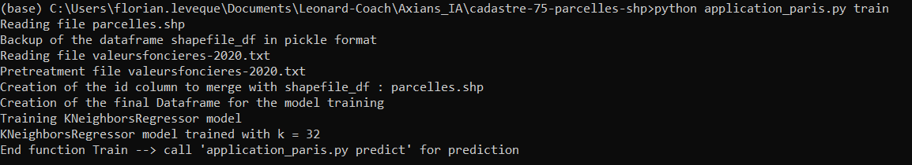
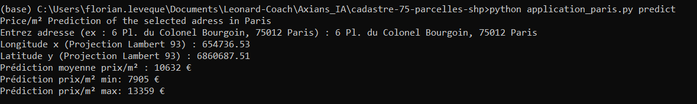

# Paris_Prediction_Price_m2_based_on_coordinates_only

## Overview
The objectif is to develop an application to predict the price per m² in Paris according to the position (x, y)

##  Architecture

The code is written in Python with the environment [VSC](https://code.visualstudio.com/docs/languages/python). The functions train and predict are both within the same file "application_paris.py".
They can be called by using the needed function as [arguments](https://www.tutorialspoint.com/python/python_command_line_arguments.htm)  of the program.

##  Requirements

* [Pandas](https://pandas.pydata.org/docs/getting_started/install.html) (version 1.2.4)
* [Numpy](https://numpy.org/install/) (version 1.20.1)
* [Shapefile](https://pypi.org/project/pyshp/) (version 2.1.3)
* [Sklearn](https://scikit-learn.org/stable/install.html) (version 0.24.1)
* [Requests](https://pypi.org/project/requests/) (version 2.25.1)
* [Joblib](https://joblib.readthedocs.io/en/latest/installing.html) (version 1.0.1)
* [Pickle](https://pypi.org/project/pickle-mixin/) (version 4.0)

##  Call visualization
<p align="center">

</p>
<p align="center">

</p>

In order to launch the creation of the application in training mode, follow the instructions below :

- Open a shell in the directory where the file ```application_paris.py``` is saved and run the command :
```
    $ python3 application_paris.py train
```
Wait until the process succeded in the creation of the model.

- Run the command to start the prediction :
```
    $ python3 application_paris.py predict
```
- Enter a adress in Paris, when asked, to obtain the prediction

##  Pretraitement
The code is already detailed and explained, but the principal steps are the followgin :

1.  ```parcelles.shp``` :  

Reading of the file parcelles.shp, creation of a Dataframe
Transform Polynom coordinates into a single point : Centroid

2. ```avaleursfoncieres-2020.txt``` :  
 
Reading of the file valeursfoncieres-2020.txt  
Drop of the columns with many missing values  
Only the appartements with a number of lots < 2 are keepped  
Modification of certains types  
Aggregation of duplicates (mean)  
Creation of the column price/m² based on "Surface reelle bati" and 'Valeur fonciere'  
Outliers removed on coherent price (articles, websites) and on the IQR method in each arrondissement separately  
Creation of an ID to merge shapefile_df : ```parcelles.shp``` a with data_paris : ```avaleursfoncieres-2020.txt```  

3. ```Merge``` :  

Creation of the final Dataframe for the model training


## Model and ameliorations
Classification model trained (accuracy on test dasaset 98.6%) : SVM deg 4 polynomial + deskewing preprocessing  
Data accessible on the website http://yann.lecun.com/exdb/mnist/  
Train data : train-images-idx3-ubyte.gz + train-labels-idx1-ubyte.gz  
Test data : t10k-images-idx3-ubyte.gz + t10k-labels-idx1-ubyte.gz

## Data used
Classification model trained (accuracy on test dasaset 98.6%) : SVM deg 4 polynomial + deskewing preprocessing  
Data accessible on the website http://yann.lecun.com/exdb/mnist/  
Train data : train-images-idx3-ubyte.gz + train-labels-idx1-ubyte.gz  
Test data : t10k-images-idx3-ubyte.gz + t10k-labels-idx1-ubyte.gz  

##  References

