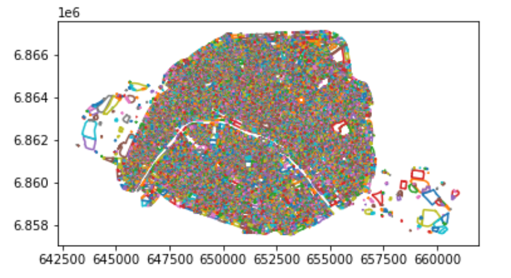
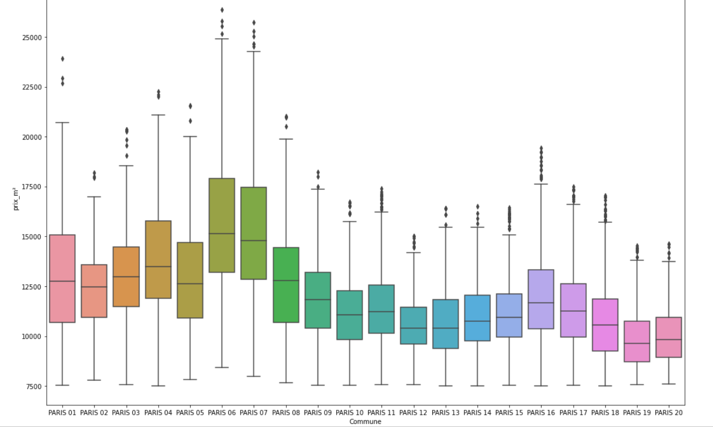
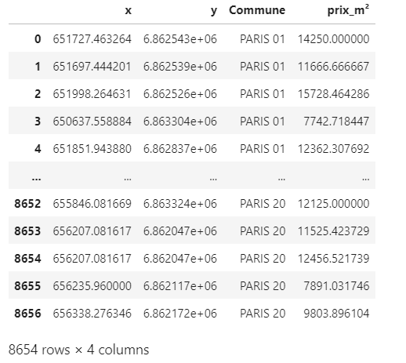

# Paris_Prediction_Price_m2_based_on_coordinates_only

## Overview
The objectif is to develop an application to predict the price per m² in Paris according to the position (x, y).

Question asked : Given a point in Paris (geographical coordinates), could you return an estimatation, as precise as possible, of the price per m2.

To facilitate the definition of the given point, an [API](https://geo.api.gouv.fr/adresse) from the french government is requested to transform the adress in (x,y) coordinates according to the correct projection (Lambert 93).

##  Architecture

The code is written in Python with the environment [VSC](https://code.visualstudio.com/docs/languages/python). The functions train and predict are both within the same file "application_paris.py".
They can be called by using the needed function as [arguments](https://www.tutorialspoint.com/python/python_command_line_arguments.htm)  of the program.

##  Requirements

* [Pandas](https://pandas.pydata.org/docs/getting_started/install.html) (version 1.2.4)
* [Numpy](https://numpy.org/install/) (version 1.20.1)
* [Shapefile](https://pypi.org/project/pyshp/) (version 2.1.3)
* [Sklearn](https://scikit-learn.org/stable/install.html) (version 0.24.1)
* [Requests](https://pypi.org/project/requests/) (version 2.25.1)
* [Joblib](https://joblib.readthedocs.io/en/latest/installing.html) (version 1.0.1)
* [Pickle](https://pypi.org/project/pickle-mixin/) (version 4.0)

##  Call visualization
<p align="center">

</p>
<p align="center">

</p>

In order to launch the creation of the application in training mode, follow the instructions below :

- Open a shell in the directory where the file ```application_paris.py``` is saved and run the command :
```
    $ python3 application_paris.py train
```
Wait until the process succeded in the creation of the model.

- Run the command to start the prediction :
```
    $ python3 application_paris.py predict
```
- Enter a adress in Paris, when asked, to obtain the prediction

##  Pretraitement
The code is already detailed and explained, but the principal steps are the followgin :

1.  ```parcelles.shp``` :  

Reading of the file parcelles.shp, creation of a Dataframe

<p align="center">

</p>

Transform Polynom coordinates into a single point : Centroid

2. ```avaleursfoncieres-2020.txt``` :  
 
Reading of the file valeursfoncieres-2020.txt  
Drop of the columns with many missing values  
Only the appartements with a number of lots < 2 are keepped  
Modification of certains types  
Aggregation of duplicates (mean)  
Creation of the column price/m² based on "Surface reelle bati" and 'Valeur fonciere'  
Outliers removed on coherent price (articles, websites) and on the IQR method in each arrondissement separately

<p align="center">

</p>

Creation of an ID to merge shapefile_df : ```parcelles.shp``` a with data_paris : ```avaleursfoncieres-2020.txt```  

3. ```Merge``` :    

Creation of the final Dataframe for the model training

<p align="center">

</p>


## Model and ameliorations

1. Model definition :  
The model used to predict the price per m² of an appartement in Paris is a KNeighborsRegressor. A StratifiedShuffleSplit method allowed to preserve the percentage of samples for each arrondissement. This is why, the latter column was keepped in the final dataset to provide train/test indices to split data in train/test sets with a stratified randomized method.  
At the end, only the columns x and y were used to train the model with the price/m² as target.  


10% of the dataset were defined for the test set, while 90% of the data were used to train the model. An iteration on the Hyperparameter k from 1 to 300 allowed to define which one is the best suited for the model. The metric used is the [mean absolute percentage error](https://scikit-learn.org/stable/modules/generated/sklearn.metrics.mean_absolute_percentage_error.html).  


Finally, the best Hyperparameter for the model is k = 32 with a mean absolute percentage error of 13.9%.

2. Discussion :  
Many improvements can be made to the model. Only the coordinates are used and all the others features present in the dataset are only used to create the id, allowing the merge with the shapefile. We can directly observe a bias when we are looking for an appartement of 20m² with 2 pieces and the neighbors are some of 100m² (observation possible in the other way also). We know that the price can be impacted by the arrondissement, a feature enginnering which can take into consideration this impact would add a great amelioration on the model (we can think of a clustering to create the latter feature). We started with 17.000 observations in Paris but at the end, only 8700 were usable, a large part located in the 18 arrondissement. The lack of data uniformly located on paris add an other bias when we consider only, the close neighbors.

We obtain a model, which predicts a naive value that is, after all, not so far from the reality on the ground (prediction given with its confidence interva).

## Data used
- List of real estate transactions carried out throughout France since 2014 : https://www.data.gouv.fr/en/datasets/r/90a98de0-f562-4328-aa16-fe0dd1dca60f  
- Documentation linked : https://www.data.gouv.fr/en/datasets/r/d573456c-76eb-4276-b91c-e6b9c89d6656  
- List of cadastral parcels in Paris : https://cadastre.data.gouv.fr/data/etalab-cadastre/2021-04-01/shp/departements/75/cadastre-75-parcelles-shp.zip  


##  References
- Shapefile : https://gist.github.com/aerispaha/f098916ac041c286ae92d037ba5c37ba  
- Sklearn_KNeighborsRegressor : https://scikit-learn.org/stable/modules/generated/sklearn.neighbors.KNeighborsRegressor.html    
- Maximum price per m² in paris : https://hureauxarnaud.medium.com/projet-estimateur-de-prix-dun-bien-immobilier-bas%C3%A9-sur-du-machine-learning-ae578fdacaca

